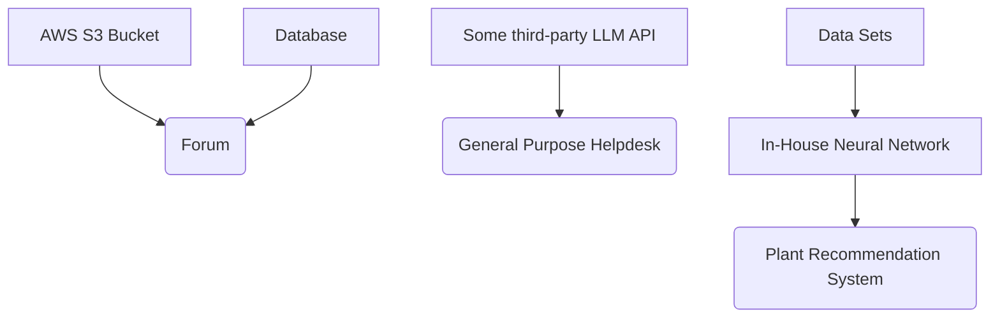

# Agora-Bloom
## Workflow diagram
It can be assumed that every rounded (or every node at the bottom) runs on an Amazon EC2 instance.

```mermaid
flowchart TD;
  F(Forum)
  O[Some third-party LLM API] --> H(General Purpose Helpdesk)
  A[AWS S3 Bucket] --> F
  D[Database] --> F
  N[In-House Neural Network] --> R(Plant Recommendation System)
  S[Data Sets] --> N
```
